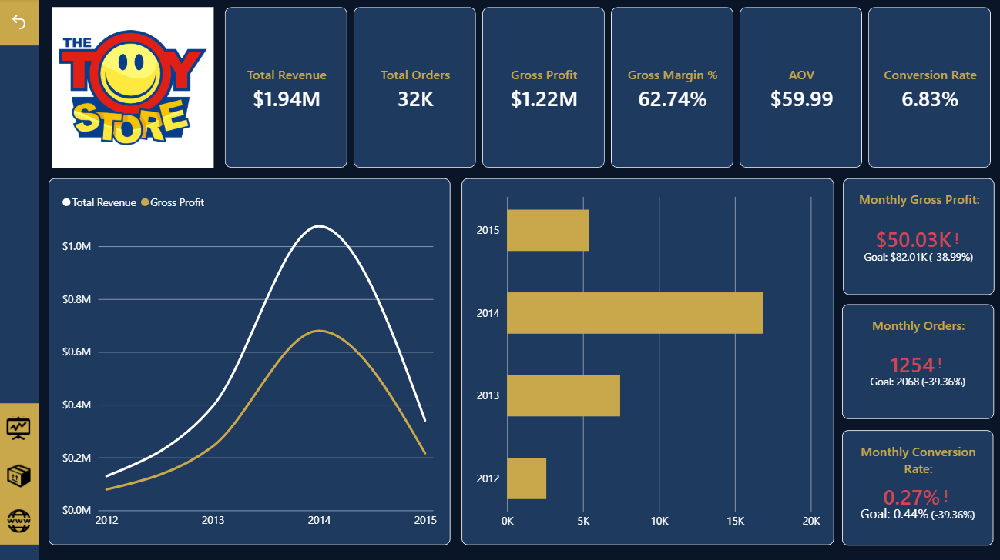
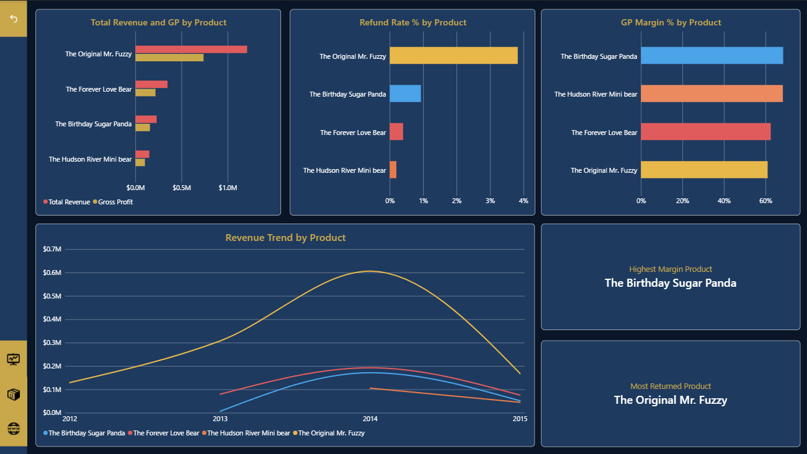
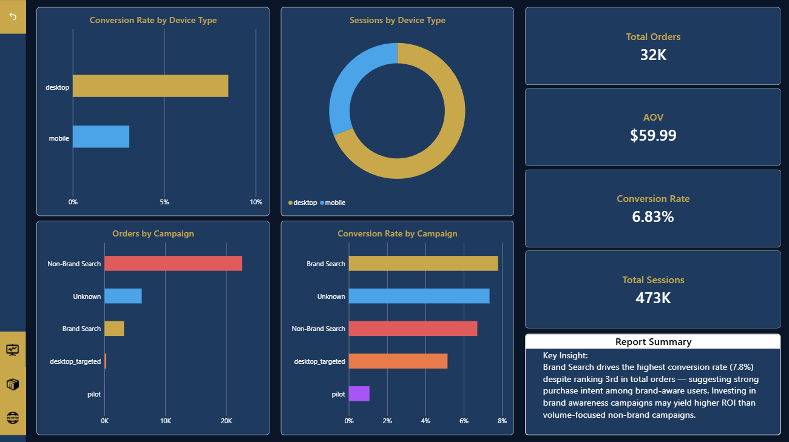

# 🧸 The Toy Store — E-Ticaret BI Dashboard

Bir oyuncak mağazasının satış performansını, ürün karlılığını ve 
trafik kaynaklarını analiz eden uçtan uca bir Power BI dashboard 
projesidir. Star Schema veri modeli ve DAX kullanılarak geliştirilmiştir.

📄 [Click here for English README](README.md)

---

## 📊 Dashboard Sayfaları

**Sayfa 1 — Yönetici Özeti**
Gelir, Sipariş Sayısı, Brüt Kar, Brüt Kar Marjı, Sipariş Başına 
Ortalama Gelir (AOV) ve Dönüşüm Oranı gibi temel iş metriklerinin 
yıllık trendi ve aylık KPI takibi.

**Sayfa 2 — Ürün Analizi**
Ürün bazında gelir, brüt kar, iade oranı ve marj performansı 
karşılaştırması. En yüksek marjlı ve en çok iade edilen ürünler 
belirlenmektedir.

**Sayfa 3 — Trafik & Kampanya Analizi**
Cihaz türüne göre performans, oturum hacmi ve kampanya bazlı 
dönüşüm oranları analizi.

---

## 🔍 Temel Bulgular

- The Original Mr. Fuzzy en yüksek geliri üretmekte ancak aynı 
zamanda en yüksek iade oranına sahip
- The Birthday Sugar Panda en güçlü brüt kar marjını sunmaktadır
- Brand Search kampanyaları %7.8 dönüşüm oranıyla tüm kanallar 
arasında en yüksek performansı göstermektedir
- Masaüstü cihazlar hem oturum sayısı hem de dönüşüm açısından 
mobili geride bırakmaktadır

---

## 🛠️ Kullanılan Araçlar ve Teknikler

- **Power BI** — Dashboard tasarımı ve görselleştirme
- **DAX** — KPI metrikleri, MoM hesaplamaları, zaman zekası
- **Power Query / M** — Veri temizleme ve takvim tablosu
- **Veri Modelleme** — 6 tablo ile Star Schema

---

## 📁 Veri Kaynağı

[Maven Analytics](https://mavenanalytics.io/) — 
Toy Store E-Commerce Dataset

---

## 📬 İletişim

[LinkedIn](https://linkedin.com/in/enes-yildirim9) | 
[GitHub](https://github.com/Lomion9)
